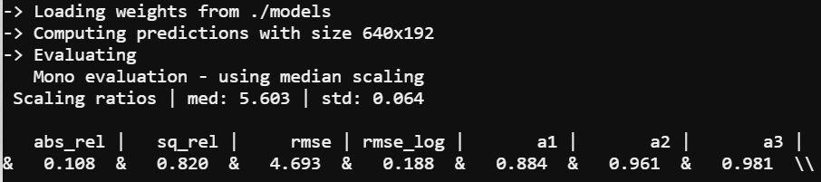

# Computer Vision in Monocular Depth Estimation

## Project Approach & Task: 
- The purport of article - Monodepth [Reference](https://arxiv.org/abs/1806.01260), introduces the use of the Self-Supervised Monocular Depth estimation technique to generate the high quality depth-from-color image to complement the LIDAR sensors. 
- Paragraphs mentioned in the paper implies the way of resolving the challenge in acquiring per-pixel ground-truth depth data at scale during the application with self-driving techniques. The authorship achieves state-of-the-art monocular depth estimation of the KITTI dataset, which performs well better than the supervised learning in ground truth depth training. However, the defect of this model is the occlusion boundary based on the pixels of the occlusion area are not visible on the way. 
- For this project, we will try to rephrase the model first and pursue differences applying loss or model architecture itself to approach the same feasible affection or better.

## MileStone:

**Our milestone are basically divided into six essential part:**

| Target      | Approached Date |
| ----------- | ----------- |
| Familiar with Monodepth & All Theorem Deadline | 03/20/22 |
| Downloading Datasets | 04/01/22 |
| Re-implement Monodepth(Train and Test) | 04/06/22 |
| Re-implement Monodepth2(Train and Test) | 04/15/22 |
| Compare & Analyze their Results | 04/25/22 |
| Prepare report and presentation | 05/03/22|

## 📝 About the technique we are tyring to approach

<div style="border: 5px solid black">
Computer Vision Application by using Monocular-Depth-Estimation Algorithm
</div>

** **

* It is bascially the fundamental API, which we are tyring to approach by using self-supervised way to perform a depth estimation by using monocular instead of access binocular investigation.


## 🚦 Interactive Deocuments & References

### Monodepth [Reference](https://github.com/nianticlabs/monodepth2)

* Research on self-supervised monocular training usually explores increasingly complex architectures, loss functions, and image formation models, all of which have recently helped to close the gap with fully-supervised methods. The monodepth2 **(PyTorch implementation for training and testing depth estimation models)** show that a surprisingly simple model, and associated design choices, lead to superior predictions. In particular, it  propose (i) a minimum reprojection loss, designed to robustly handle occlusions, (ii) a full-resolution multi-scale sampling method that reduces visual artifacts, and (iii) an auto-masking loss to ignore training pixels that violate camera motion assumptions.

> **Digging into Self-Supervised Monocular Depth Prediction**
>
> [Clément Godard](http://www0.cs.ucl.ac.uk/staff/C.Godard/), [Oisin Mac Aodha](http://vision.caltech.edu/~macaodha/), [Michael Firman](http://www.michaelfirman.co.uk) and [Gabriel J. Brostow](http://www0.cs.ucl.ac.uk/staff/g.brostow/)
>
> [ICCV 2019 (arXiv pdf)](https://arxiv.org/abs/1806.01260)

* Effective of Monodepth: 

<p align="center">
  
</p>

* Effective of Monodepth2: 

<p align="center">
  
</p>

This code is for non-commercial use; please see the [license file](LICENSE) for terms.

If you find our work useful in your research please consider citing our paper:

```
@article{monodepth2,
  title     = {Digging into Self-Supervised Monocular Depth Prediction},
  author    = {Cl{\'{e}}ment Godard and
               Oisin {Mac Aodha} and
               Michael Firman and
               Gabriel J. Brostow},
  booktitle = {The International Conference on Computer Vision (ICCV)},
  month = {October},
year = {2019}
}
```


## 💬 Digging into the "Monodepth-V2" VS "Monodepth" 


### 📘 Per-Pixel Minimum Reprojection Loss

> Problem: Existing average together the reprojection error into each of the available source images, It can cause issues with pixels that are visible in the target image, but are not visible in some of the source images.
>
> Inituitive: The Per-Pixel Minimum Reprojection Loss can help with it rather than Average. It has been validated effectivelly improves the sharpness of occlusion boundaries, and leads to better accuracy.


### 📘 Auto-Masking Stationary Pixels

> Problem: When the camera is stationary or there is object motion in the scene, The monocular Depth estimation based on Self-supervised monocular training performance can suffer greatly. 
> 
> Intuitive: A simple auto-masking method that filters out pixels which do not change appearance from one frame to the next in the sequence. This has the effect of letting the network ignore objects which move at the same velocity as the camera, and even to ignore whole frames in monocular videos when the camera stops moving.

## How to reimplement it:

### Prerequisites
This code was tested with PyTorch 0.4.1, CUDA 9.1 and Ubuntu 16.04. Other required modules:
```
torchvision
numpy
matplotlib
easydict
```
You can install the dependencies with:
```
conda install pytorch=0.4.1 torchvision=0.2.1 -c pytorch
pip install tensorboardX==1.4
conda install opencv=3.3.1   # just needed for evaluation
```
For Monodepth2, we recommend to create a virtual environment with Python 3.6.6 `conda create -n monodepth2 python=3.6.6 anaconda`.

### 📘 Dataset
### KITTI
This algorithm requires stereo-pair images for training and single images for testing. KITTI dataset was used for training. It contains 38237 training samples. Raw dataset (about 175 GB) can be downloaded by running:
```
wget -i splits/kitti_archives_to_download.txt -P kitti_data/
```
kitti_archives_to_download.txt may be found in this repo.

Then unzip with

```
cd kitti_data
unzip "*.zip"
cd ..
```

### 📘 Reimplement Monodepth Model

### Training
Example of training can be find in Monodepth.ipynb notebook.

Model class from main_monodepth_pytorch.py should be initialized with following params (as easydict) for training:

- `data_dir`: path to the dataset folder
- `val_data_dir`: path to the validation dataset folder
- `model_path`: path to save the trained model
- `output_directory`: where save dispairities for tested images
- `input_height`
- `input_width`
- `model`: model for encoder (resnet18_md or resnet50_md or any torchvision version of Resnet (resnet18, resnet34 etc.)
- `pretrained`: if use a torchvision model it's possible to download weights for pretrained model
- `mode`: train or test
- `epochs`: number of epochs,
- `learning_rate`
- `batch_size`
- `adjust_lr`: apply learning rate decay or not
- `tensor_type`:'torch.cuda.FloatTensor' or 'torch.FloatTensor'
- `do_augmentation`:do data augmentation or not
- `augment_parameters`:lowest and highest values for gamma, lightness and color respectively
- `print_images`
- `print_weights`
- `input_channels`: Number of channels in input tensor (3 for RGB images)
- `num_workers`: Number of workers to use in dataloader
Optionally after initialization, we can load a pretrained model via `model.load`.

After that calling train() on Model class object starts the training process.

Also, it can be started via calling main_monodepth_pytorch.py through the terminal and feeding parameters as argparse arguments.

### Testing
Example of training can be find in Monodepth notebook.

Model class from main_monodepth_pytorch.py should be initialized with following params (as easydict) for training:
- `data_dir`: path to the dataset folder
- `model_path`: path to save the trained model
- `pretrained`
- `output_directory`: where save dispairities for tested images
- `input_height`
- `input_width`
- `model`: model for encoder (resnet18 or resnet50)
- `mode`: train or test
- `input_channels`: Number of channels in input tensor (3 for RGB images)
- `num_workers`: Number of workers to use in dataloader
After that calling test() on Model class object starts testing process.

Also it can be started via calling main_monodepth_pytorch.py through the terminal and feeding parameters as argparse arguments.

### 📘 Reimplement Monodepth2 Model
### Training
By default models and tensorboard event files are saved to `~/tmp/<model_name>`. This can be changed with the `--log_dir` flag.

**Monocular training:**
```
python train.py --model_name mono_model
```
**Stereo training:**

Our code defaults to using Zhou's subsampled Eigen training data. For stereo-only training we have to specify that we want to use the full Eigen training set – see paper for details.
```
python train.py --model_name stereo_model \
  --frame_ids 0 --use_stereo --split eigen_full
```
**Monocular + stereo training:**
```
python train.py --model_name mono+stereo_model \
  --frame_ids 0 -1 1 --use_stereo
```
### Testing
To prepare the ground truth depth maps run:
```
python export_gt_depth.py --data_path kitti_data --split eigen
python export_gt_depth.py --data_path kitti_data --split eigen_benchmark
```
...assuming that you have placed the KITTI dataset in the default location of `./kitti_data/`.

The following example command evaluates the epoch 19 weights of a model named `mono_model`:
```
python evaluate_depth.py --load_weights_folder ~/tmp/mono_model/models/weights_19/ --eval_mono
```
For stereo models, you must use the `--eval_stereo` flag (see note below):
```
python evaluate_depth.py --load_weights_folder ~/tmp/stereo_model/models/weights_19/ --eval_stereo
```

## 💬 Results:

### Monodepth
<p align="center">
  
</p>

Because the training time of monodepth model is too long (nearly 70 hours), we only trained for nearly 50 hours. This figure shows the test results of the model after 50 hours of training. It can be seen that some details are missing compared with the pre trained model, but the overall depth of the scene can be seen.
### Monodepth2
- Result of Pretrained Model 
<p align="center">
  
</p>

- Result of Our Trained Model
<p align="center">
  
</p>

From the two figures above, we can see that the evaluation result  of our model is pretty close to the pretrained model with same image resolution. 

## 📊 Conclusion
In this project, we reimplemented monodepth and monodepth2 models successfully, evaluated their performance respectively, and compared their results with ours. However, because the training of monodepth model is too time-consuming, it takes nearly 70 hours to complete the training. So the performance of the monodepth model we trained is not as good as that of the pretrained model. Therefore, if possible, we will try to train the model again to see if it will have a better performance. In a word, we learned more about self supervised learning, and had a better understanding of the training method of monocular depth prediction, as well as how the loss function of different targets works.
